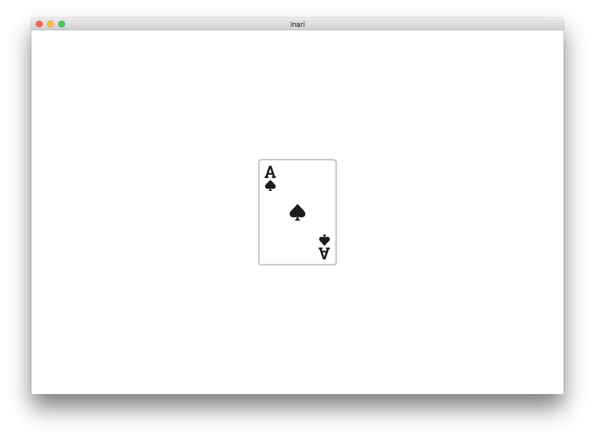

# Inari Box

_Inari Box_ is a trivial example of the [Glove](http://github.com/ddfreyne/glove) game engine.

Use `make` to build the game.

## Acknowledgements

The playing card assets are by [Kenney](http://kenney.nl/assets). The dice icon is by [Aroche](http://aroche.deviantart.com/).
